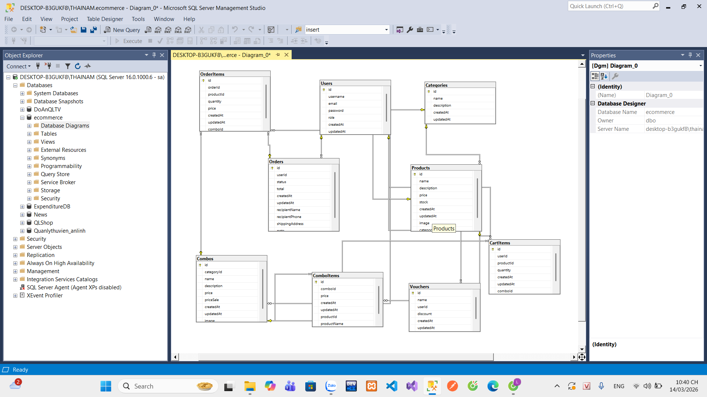

## Mô tả dự án: sử dụng express(nodejs) cho backend và react-native(dùng expo để chạy) cho frontend
## Thư mục chính:
### src: chứa các api để gọi đến và tương tác với database
  + Sử dụng express để code các api và sử dụng sequelize(ORM) để dễ dàng tương tác (CRUD) với cơ sở dữ liệu (SQL Server)
  + Thư mục Model trong thư mục src đại diện cho các bảng
  + API sẽ được bảo mật bằng 2 cách:
    + Các API như đăng nhập, đăng ký sẽ cần phải được cấp khóa mới có thể gọi
    + Các API của người dùng sử dụng như thêm sản phẩm vào giỏ hàng, tạo đơn hàng, thanh toán,... chỉ được gọi khi kiểm tra đúng token của user đó. Khi user đăng ký sẽ trả về token trong token sẽ có các thông tin của người dùng được mã hóa và được lưu trong JWWT
### ecommerce-app-frontend: chứa các screen được viết bằng react

## Database diagram

## Ảnh một số screen nằm trong thư mục picture

## Hướng dẫn chạy dự án
+ Cài đặt nodeJS phiên bản 20, sau khi cài thì chạy lệnh npm install để cài các thư viện 
+ Cài đặt ứng dụng expo trên điện thoại
+ Mở 2 terminal để chạy frontend, backend
+ Ở thư mục backend(src) chạy lệnh npm start để khởi chạy api và kết nối với DB
+ Ở thư mục frontend(ecommerce-app-frontend) chạy lệnh npm start, khi có mã QR sử dụng điện thoại quét để tương tác với giao diện
+ Tải file db và import vào sql server (tài khoản demo: nam209@gmail.com | mk:123456)

## Thiếu sót của dự án:
+ Chưa mở rộng thêm chức năng dành cho shipper để thực hiện theo đúng quy trình thực tế và khách hàng có thể theo dõi đơn hàng của mình đang ở đâu
