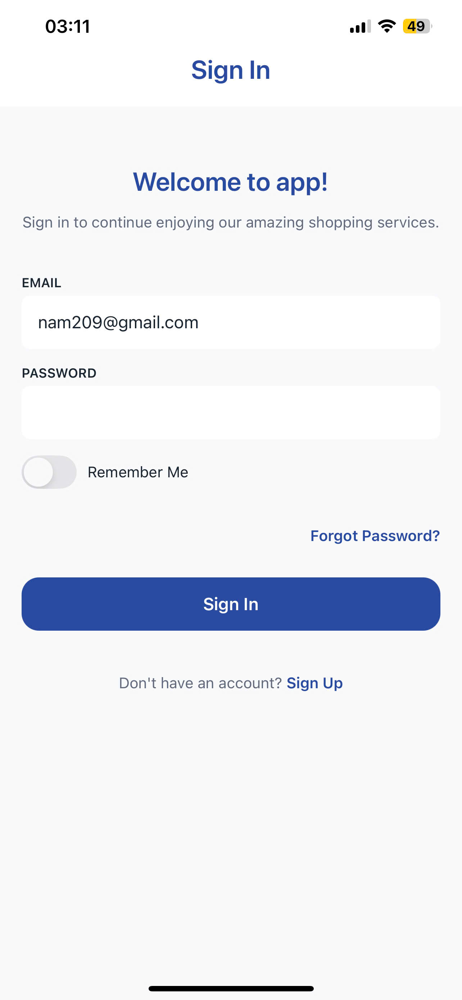
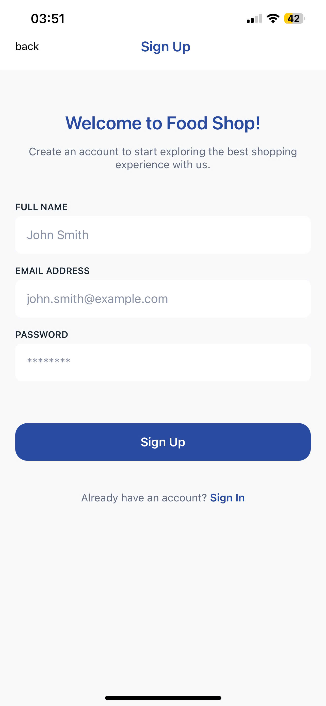
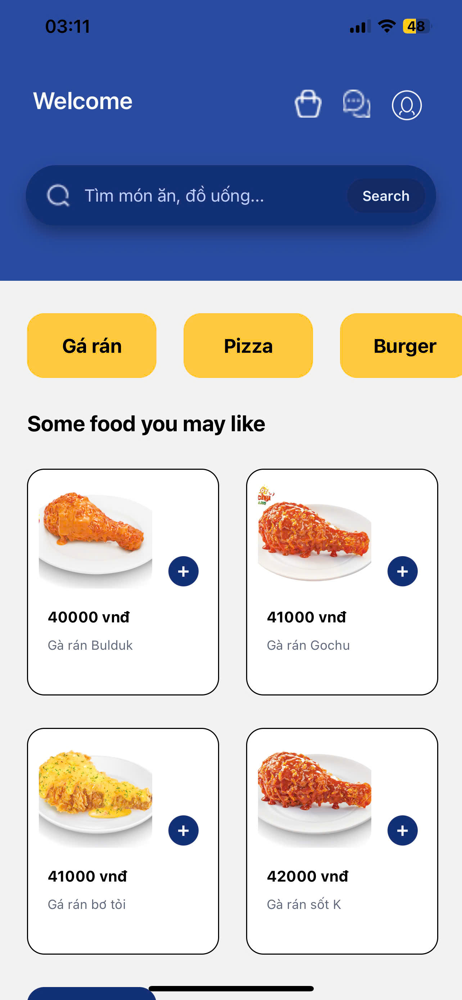
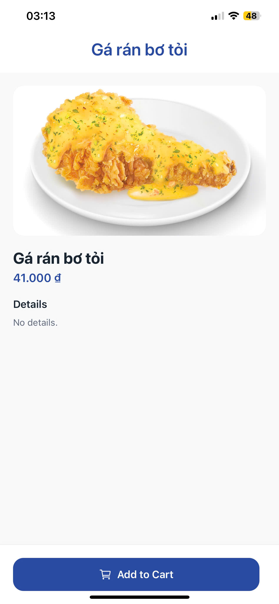
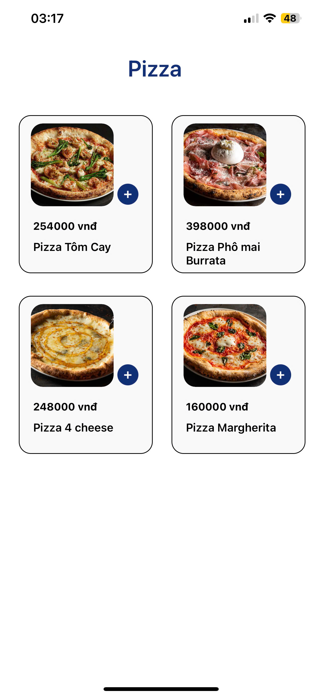
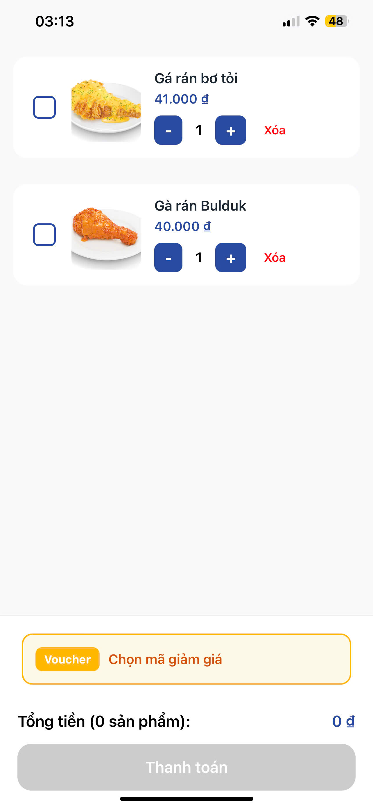
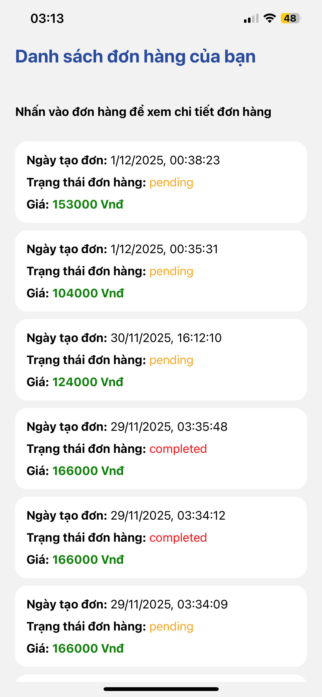
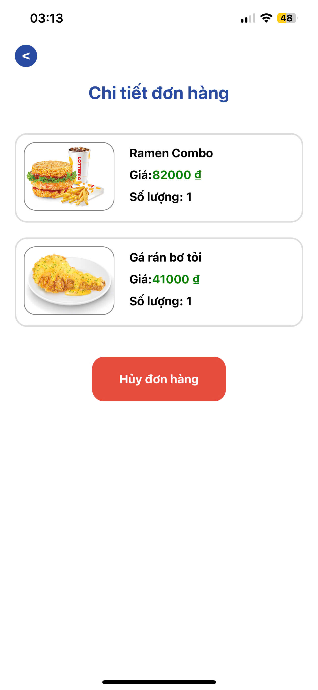

## Mô tả dự án: sử dụng express(nodejs) cho backend và react-native(dùng expo để chạy) cho frontend
## Thư mục chính:
+ src: chứa các api để gọi đến và tương tác với database
+ ecommerce-app-frontend: chứa các screen

## Ảnh một số screen:
### Ảnh màn hình đăng nhập và đăng ký

### Ảnh màn hình trang chủ

### Ảnh màn hình sản phẩm

### Ảnh màn hình loại sản phẩm

### Ảnh màn hình giỏ hàng

### Ảnh màn hình list các đơn hàng

### Ảnh màn hình chi tiết đơn hàng

## Thiếu sót của dự án:
+ Chưa có thanh toán online
+ Chưa có gitignore để không up file .env lên git
+ ....
